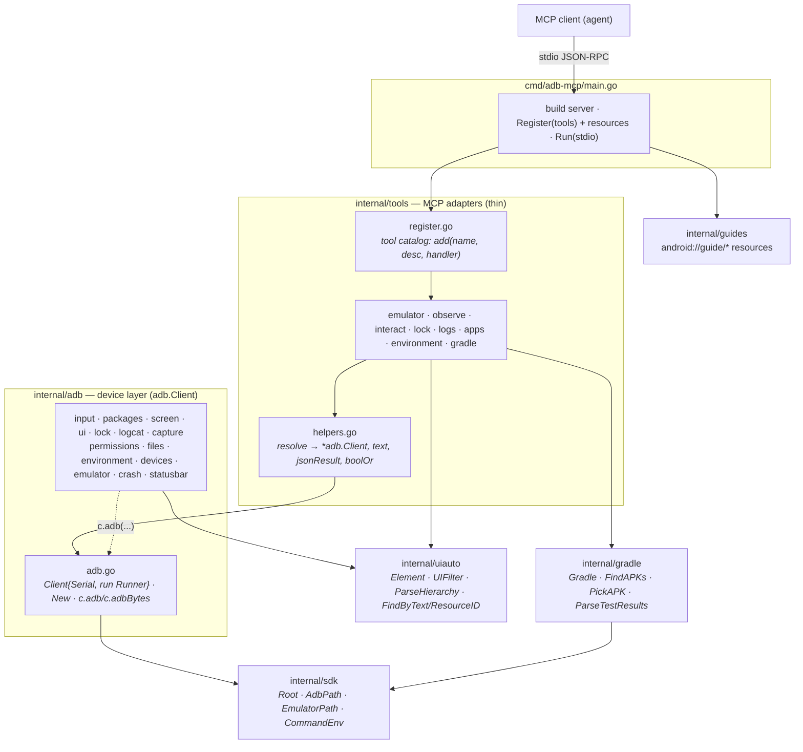

# Architecture

Five packages in a strict dependency line, and one convention: **every MCP tool
file mirrors an execution file of the same name.** Find a tool and its real
logic sits one layer down under the matching filename.

```
cmd/adb-mcp/main.go    entry: build server, register tools + resources, Run(stdio)
internal/tools/        thin MCP adapters — resolve a device, call adb/gradle, format
internal/adb/          the device layer: an adb.Client whose methods are the commands
internal/gradle/       host-side Gradle: build, find APKs, parse test reports
internal/uiauto/       pure uiautomator-hierarchy model + parsing (Element, filters, find)
internal/sdk/          resolves the Android SDK (adb/emulator paths, PATH env)
internal/guides/       the skill guides, embedded and served as MCP resources
```

Dependencies point inward only: `sdk` and `uiauto` are leaves; `gradle → sdk`;
`adb → sdk, uiauto`; `tools → adb, gradle, uiauto`. Nothing imports `tools`, and
no execution package imports the MCP SDK.

## Diagram

Source: [`docs/architecture.mmd`](docs/architecture.mmd) (rendered below; GitHub
renders the Mermaid block natively).



## The layers

**`internal/sdk` — SDK resolution.** Where `adb` and `emulator` live and the
`PATH` they need. The leaf both the device and build layers share, so neither
re-derives SDK paths.

**`internal/uiauto` — the UI model.** `Element`/`Bounds`/`Point`/`UIFilter` and
the pure functions over them: parse a uiautomator XML dump, filter it, find an
element by text or resource id. No I/O, no adb — trivially unit-testable, and
the type vocabulary the device layer returns.

**`internal/adb` — the device layer.** An `adb.Client` holds a device serial and
a `Runner` (the one seam that shells out). Every device command is a **method**
(`c.Tap`, `c.InstallApp`, `c.DescribeUI`, …) that builds an argv and calls
`c.adb`/`c.adbBytes`. `New(serial)` wires the real adb binary; a test wires a
fake `Runner` and asserts the exact argv — so command builders are unit-tested
with **no device** (see `client_test.go`). Hostless helpers that have no serial
(`ListDevices`, `BootEmulator`, `ConnectWireless`, `Doctor`) stay package funcs.

**`internal/gradle` — host-side builds.** `Gradle` runs the wrapper; `FindAPKs`
locates outputs (newest-first, `node_modules`/dot-dirs pruned); `PickAPK` skips
androidTest APKs; `ParseTestResults` reads the JUnit XML. Depends only on `sdk`.

**`internal/tools` — MCP adapters.** Each handler is deliberately thin: `resolve`
the target device into an `*adb.Client`, call one method (or a gradle/uiauto
function), format the result. `register.go` is *only* the tool catalog
(`add(name, description, handler)`); it holds no handler bodies.

## The mirror

Each domain has a file in `internal/tools` and a matching execution file. To
change a tool, you touch two same-named files — one for the wire/argument shape,
one for the behavior.

| Domain | execution | `internal/tools/` (MCP adapter) |
|---|---|---|
| adb client core | `adb/adb.go` | `helpers.go` (`resolve → *adb.Client`) |
| device enumerate / resolve / connect | `adb/devices.go` | `emulator.go` |
| emulator lifecycle | `adb/emulator.go` | `emulator.go` |
| screen capture | `adb/screen.go`, `adb/image.go` | `observe.go` |
| runtime UI observe | `adb/ui.go` + `uiauto/uiauto.go` | `observe.go` |
| input / gestures / PIN | `adb/input.go`, `adb/keyevent.go` | `interact.go` |
| device lock | `adb/lock.go` | `lock.go` |
| logs & recording | `adb/logcat.go`, `adb/capture.go` | `logs.go` |
| app lifecycle | `adb/packages.go` | `apps.go` |
| permissions | `adb/permissions.go` | `apps.go` |
| file transfer | `adb/files.go` | `apps.go` |
| environment (dark / geo / doctor) | `adb/environment.go`, `adb/doctor.go` | `environment.go` |
| gradle build & test | `gradle/gradle.go`, `gradle/testreport.go` | `gradle.go` |
| SDK paths / shared helpers | `sdk/sdk.go` | `helpers.go` |

## Conventions

- **Device commands are `adb.Client` methods; pure logic is a plain function.**
  Anything that shells out becomes a method on `*Client` so it is injectable and
  testable; parsing/geometry lives in `uiauto` (or a pure func) with its own test.
- **Handlers own their argument structs.** Each `tools/<domain>.go` declares the
  `…Args` structs (with `jsonschema` tags) for the handlers in that file.
- **Truly shared adapter helpers live in `helpers.go`:** `serialArg`, `text`,
  `jsonResult`, `resolve`, `boolOr`. Domain-specific helpers stay with their
  domain (`parseCoords` in `interact.go`, `tailLines` in `gradle.go`).
- **Dependencies point inward only.** No execution package imports `internal/tools`
  or the MCP SDK. Logic that needs testing belongs below `internal/tools`; only
  wire-format glue belongs in it.

## Adding a tool

1. Implement the behavior where it belongs: a device command → a method on
   `adb.Client` in the matching `internal/adb/<domain>.go`; pure parsing →
   `internal/uiauto`; a build step → `internal/gradle`. Unit-test it there (a
   command builder with a fake `Runner`; pure logic directly).
2. Add the argument struct and a thin handler to the matching `internal/tools/<domain>.go`.
3. Register it in `internal/tools/register.go` with a model-facing description.
