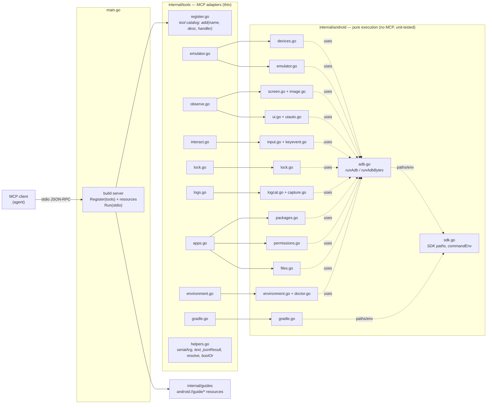

# Architecture

Two layers, one convention: **every MCP tool file mirrors an execution file of
the same name.** Find a tool and its real logic sits one package down under the
matching filename.

```
main.go                entry: build server, register tools + resources, Run(stdio)
internal/android/      pure adb/emulator execution + uiautomator parsing (no MCP, unit-tested)
internal/tools/        thin MCP adapters over internal/android
internal/guides/       the skill guides, embedded and served as MCP resources
```

## Diagram

Source: [`docs/architecture.mmd`](docs/architecture.mmd) (rendered below; GitHub
renders the Mermaid block natively).



## The two layers

**`internal/android/` — execution.** Pure Go over `adb`/`emulator`. Knows
nothing about MCP, so it stays independently unit-testable. Every device call
funnels through `runAdb`/`runAdbBytes` in `adb.go`.

**`internal/tools/` — MCP adapters.** Each handler is deliberately thin: resolve
the target device, call one `internal/android` function, format the result.
Keeping it thin is what keeps the real logic testable without MCP. `register.go`
is *only* the tool catalog (`add(name, description, handler)`); it holds no
handler bodies.

## The mirror

Each domain has a file in both packages. To change a tool, you touch two files
with the same name — one for the wire/argument shape, one for the behavior.

| Domain | `internal/android/` (execution) | `internal/tools/` (MCP adapter) |
|---|---|---|
| adb exec core | `adb.go` | — |
| device enumerate / resolve / connect | `devices.go` | `emulator.go` |
| emulator lifecycle | `emulator.go` | `emulator.go` |
| screen capture | `screen.go`, `image.go` | `observe.go` |
| runtime UI observe | `ui.go`, `uiauto.go` | `observe.go` |
| input / gestures / PIN | `input.go`, `keyevent.go` | `interact.go` |
| device lock | `lock.go` | `lock.go` |
| logs & recording | `logcat.go`, `capture.go` | `logs.go` |
| app lifecycle | `packages.go` | `apps.go` |
| permissions | `permissions.go` | `apps.go` |
| file transfer | `files.go` | `apps.go` |
| environment (dark / geo / doctor) | `environment.go`, `doctor.go` | `environment.go` |
| gradle | `gradle.go` | `gradle.go` |
| SDK paths / shared helpers | `sdk.go` | `helpers.go` |

## Conventions

- **Handlers own their argument structs.** Each `tools/<domain>.go` declares the
  `…Args` structs (with `jsonschema` tags) for the handlers in that file.
- **Truly shared adapter helpers live in `helpers.go`:** `serialArg`, `text`,
  `jsonResult`, `resolve`, `boolOr`. Domain-specific helpers stay with their
  domain (`parseCoords`/`firstInt` in `interact.go`, `tailLines` in `gradle.go`).
- **The layer boundary is one-directional.** `internal/android` never imports
  `internal/tools` or the MCP SDK. Logic that needs testing belongs in
  `internal/android`; only wire-format glue belongs in `internal/tools`.

## Adding a tool

1. Implement the behavior as a function in the matching `internal/android/<domain>.go`
   (or a new domain file), and unit-test it there.
2. Add the argument struct and a thin handler to the matching `internal/tools/<domain>.go`.
3. Register it in `internal/tools/register.go` with a model-facing description.
